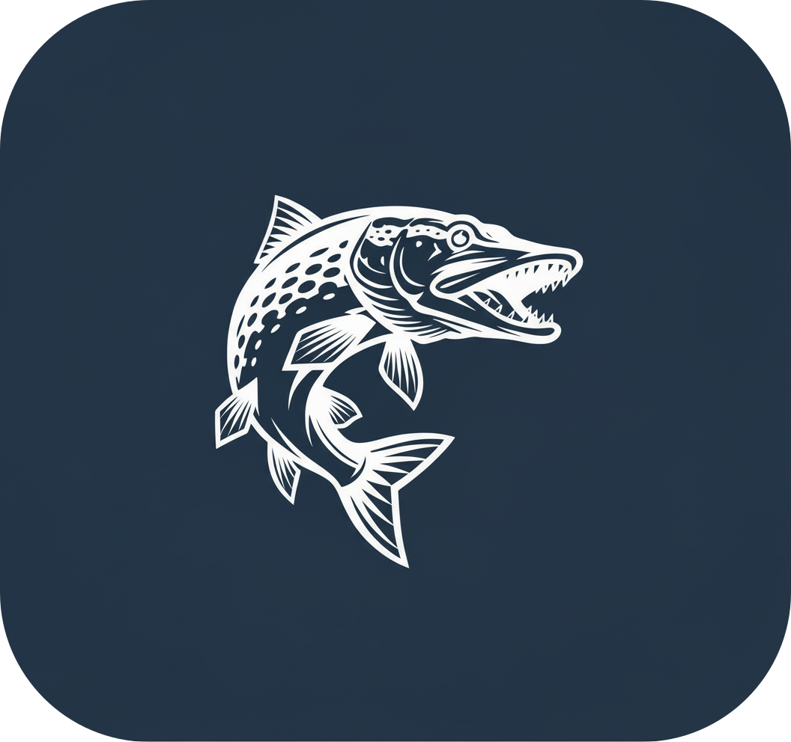

  

<h1 align="center">StrikeFeed</h1>

  <strong>Catch the moment. Share the story.</strong> 
  A mobile companion for anglers to log catches, discover fishing spots, and connect with the fishing community.

  
  
  

  <a href="#features">Features</a> ·
  <a href="#get-strikefeed">Get StrikeFeed</a> ·
  <a href="#privacy-and-terms">Privacy</a>

---

## The fishing journal that goes where you go

StrikeFeed turns every trip into a useful record. Save the catch, pin the place, add the details that matter, and revisit the story when the next great day on the water begins.

Designed for Russian-speaking anglers and already seen by more than **6,900 people on RuStore**, StrikeFeed combines a personal catch log with a social fishing community.

  

## Get StrikeFeed

  
  
  

## Features

| | What you can do |
| :-- | :-- |
| 🎣 | **Log every catch** — record species, size, weight, gear, notes, photos, and the moment it happened. |
| 📍 | **Explore the map** — see catches and fishing spots in context with location-aware mapping. |
| 📸 | **Keep the proof** — attach a photo from the camera or library, including additional catch photos. |
| 🌦️ | **Plan with confidence** — check fishing-focused weather before heading out. |
| 🐟 | **Know your species and gear** — use a broad catalog of freshwater and saltwater species, baits, and tackle. |
| 👥 | **Join the community** — share catches, react, comment, follow anglers, and take part in groups. |
| 📶 | **Fish offline** — keep logging even without reception; pending catches sync when the connection returns. |
| 🔐 | **Make it yours** — sign in with email, Google, Yandex, or Apple and keep your profile and records together. |

## Privacy and terms

StrikeFeed requests only the device permissions necessary for its features: location for the fishing map, camera and photo access for catch records, and notifications when enabled by the user.

- [Privacy Policy](https://sergei4k.github.io/fishingapp/privacy-policy.html)
- [Terms of Service](https://sergei4k.github.io/fishingapp/terms.html)

---

  Made for anglers who never want to forget a great catch. 🎣

